# DCGAN


## 資料來源
資料集來自kaggle [House Rooms Image Dataset](https://www.kaggle.com/datasets/robinreni/house-rooms-image-dataset/data)

客廳的圖片共計1273張

## 開發環境
- Windows 10
- 11th Gen Intel(R) Core(TM) i7-11800H @ 2.30GHz
- RAM：16.0 GB
- NVIDIA GeForce RTX 3070 Laptop GPU
- Python 3.9
- PyTorch 1.13.0

## DCGAN模型
DCGAN是一個加入CNN概念的GAN模型，與GAN最主要的差異是將全連接轉換成卷積，納入了CNN對圖像處理的優勢。

使用生成器不斷生成圖片，再利用鑑別器判斷這張圖片像不像真的，透過不斷反覆訓練及修正，進而優化模型以達到模擬真實圖片的效果。

## 生成器
```python
import torch.nn as nn

# Generator
class Generator(nn.Module):
    def __init__(self, inputSize, hiddenSize, outputSize):
        super(Generator, self).__init__()
        self.main = nn.Sequential(
            nn.ConvTranspose2d(inputSize, hiddenSize*8, 4, 1, 0, bias=False),
            nn.BatchNorm2d(hiddenSize*8),
            nn.ReLU(True),

            nn.ConvTranspose2d(hiddenSize*8, hiddenSize*4, 4, 2, 1, bias=False),
            nn.BatchNorm2d(hiddenSize*4),
            nn.ReLU(True),

            nn.ConvTranspose2d(hiddenSize*4, hiddenSize*2, 4, 2, 1, bias=False),
            nn.BatchNorm2d(hiddenSize*2),
            nn.ReLU(True),

            nn.ConvTranspose2d(hiddenSize*2, hiddenSize, 4, 2, 1, bias=False),
            nn.BatchNorm2d(hiddenSize),
            nn.ReLU(True),

            nn.ConvTranspose2d(hiddenSize, outputSize, 4, 2, 1, bias=False),
            nn.Tanh())

    def forward(self, input):
        return self.main(input)
```

## 鑑別器
```python
import torch.nn as nn

# Discriminator
class Discriminator(nn.Module):
    def __init__(self, inputSize, hiddenSize):
        super(Discriminator, self).__init__()
        self.main = nn.Sequential(
            nn.Conv2d(inputSize, hiddenSize, 4, 2, 1, bias=False),
            nn.LeakyReLU(0.2, inplace=True),

            nn.Conv2d(hiddenSize, hiddenSize*2, 4, 2, 1, bias=False),
            nn.BatchNorm2d(hiddenSize*2),
            nn.LeakyReLU(0.2, inplace=True),

            nn.Conv2d(hiddenSize*2, hiddenSize*4, 4, 2, 1, bias=False),
            nn.BatchNorm2d(hiddenSize*4),
            nn.LeakyReLU(0.2, inplace=True),

            nn.Conv2d(hiddenSize*4, hiddenSize*8, 4, 2, 1, bias=False),
            nn.BatchNorm2d(hiddenSize*8),
            nn.LeakyReLU(0.2, inplace=True),

            nn.Conv2d(hiddenSize*8, 1, 4, 1, 0, bias=False),
            nn.Sigmoid())

    def forward(self, input):
        return self.main(input)
```

## 匯入套件
```python
import random
import torch.nn as nn
import torch.optim as optim
import torch.utils.data
import torchvision.datasets as dset
import torchvision.transforms as transforms
import torchvision.utils as vutils
import numpy as np
import matplotlib.pyplot as plt
from Generator import Generator
from Discriminator import Discriminator
import time
import datetime
import os
os.environ["KMP_DUPLICATE_LIB_OK"]="TRUE"
```
## 使用GPU加速
```python
# CUDA
device = 'cuda:0' if torch.cuda.is_available() else 'cpu'
print('GPU State:', device)
gpu_count = torch.cuda.device_count()
print(f'Have {gpu_count} gpu')
```

輸出結果：
```
GPU State: cuda:0
Have 1 gpu
```

## 設置參數
```python
batch_size = 16
image_size = 64
G_out_D_in = 3
G_in = 100
G_hidden = 64
D_hidden = 64

epochs = 300
lr = 0.0001
beta1 = 0.5
```

## 超參數調整範圍
batch size : 16 ~ 100  (根據epochs做調整)

epochs  : 200 ~ 1500  (執行時間10 ~ 52分鐘)

learning rate  : 0.0001


## 圖像載入與預處理
```python
# Data
dataset = dset.ImageFolder(root=dataroot,
                           transform=transforms.Compose([
                               transforms.Resize(image_size),
                               transforms.CenterCrop(image_size),
                               transforms.ToTensor(),
                               transforms.Normalize((0.5, 0.5, 0.5), (0.5, 0.5, 0.5))
                           ]))

# Create the dataLoader
dataLoader = torch.utils.data.DataLoader(dataset, batch_size=batch_size, shuffle=True)
```

用transforms將改變圖片尺寸、裁切、轉成Tensor、正規化。

用DataLoader將照片依照設定好的batch_size大小一批一批讀進來。

## 設定初始權重
```python
# Weights
def weights_init(m):
    classname = m.__class__.__name__
    print('classname:', classname)

    if classname.find('Conv') != -1:
        nn.init.normal_(m.weight.data, 0.0, 0.02)
    elif classname.find('BatchNorm') != -1:
        nn.init.normal_(m.weight.data, 1.0, 0.02)
        nn.init.constant_(m.bias.data, 0)
```

## 訓練模型
```python
# Train
def train():
    # Create the generator
    netG = Generator(G_in, G_hidden, G_out_D_in).to(device)
    netG.apply(weights_init)
    print(netG)

    # Create the discriminator
    netD = Discriminator(G_out_D_in, D_hidden).to(device)
    netD.apply(weights_init)
    print(netD)

    # Loss fuG_out_D_intion
    criterion = nn.BCELoss()
    fixed_noise = torch.randn(64, G_in, 1, 1, device=device)

    real_label = 1.0
    fake_label = 0
    optimizerD = optim.Adam(netD.parameters(), lr=lr, betas=(beta1, 0.999))
    optimizerG = optim.Adam(netG.parameters(), lr=lr, betas=(beta1, 0.999))


    iters = 0
    print('Start!')

    for epoch in range(epochs):
        for i, data in enumerate(dataLoader, 0):
            # Update D network
            netD.zero_grad()
            real_cpu = data[0].to(device)
            b_size = real_cpu.size(0)
            label = torch.full((b_size,), real_label, device=device)
            output = netD(real_cpu).view(-1)

            errD_real = criterion(output, label)
            errD_real.backward()
            D_x = output.mean().item()

            noise = torch.randn(b_size, G_in, 1, 1, device=device)
            fake = netG(noise)
            label.fill_(fake_label)
            output = netD(fake.detach()).view(-1)

            errD_fake = criterion(output, label)
            errD_fake.backward()

            D_G_z1 = output.mean().item()
            errD = errD_real + errD_fake
            optimizerD.step()

            # Update G network
            netG.zero_grad()
            label.fill_(real_label)
            output = netD(fake).view(-1)
            errG = criterion(output, label)
            errG.backward()
            D_G_z2 = output.mean().item()
            optimizerG.step()

            # Output training stats
            if i % 50 == 0:
                print('[%d/%d][%d/%d]\tLoss_D: %.4f\tLoss_G: %.4f\tD(x): %.4f\tD(G(z)): %.4f / %.4f' % (epoch, epochs, i, len(dataLoader), errD.item(), errG.item(), D_x, D_G_z1, D_G_z2))

            # Save Losses for plotting later
            G_losses.append(errG.item())
            D_losses.append(errD.item())

            # Check how the generator is doing by saving G's output on fixed_noise
            if (iters % 500 == 0) or ((epoch == epochs - 1) and (i == len(dataLoader) - 1)):
                with torch.no_grad():
                    fake = netG(fixed_noise).detach().cpu()

                img_list.append(vutils.make_grid(fake, padding=2, normalize=True))

            iters += 1

    torch.save(netD, 'netD.pkl')
    torch.save(netG, 'netG.pkl')

    return G_losses, D_losses
```

優化器使用了Adam、損失函數則是Binary Cross Entropy

## 繪製並儲存圖表及圖像
```python
# Plot
file_name = f'lr={lr}_bs={batch_size}_ep={epochs}'
now = datetime.datetime.now()
now = now.strftime('%m%d_%H.%M')
parent_dir = 'fig'
path = os.path.join(parent_dir, now)
if not os.path.exists(path):
    try:
        os.makedirs(path)
    except:
        raise OSError("Can't create destination directory (%s)!" % (path))

def plotImage(G_losses, D_losses):
    print('Start to plot!!')
    plt.figure(figsize=(10, 5))
    plt.title("Generator and Discriminator Loss During Training")
    plt.plot(G_losses, label="G")
    plt.plot(D_losses, label="D")
    plt.xlabel("iterations")
    plt.ylabel("Loss")
    plt.legend()
    plt.savefig(f'{path}/Loss_{file_name}.png')
    plt.show()

    # Grab a batch of real images from the dataloader
    real_batch = next(iter(dataLoader))

    # Plot the real images
    plt.figure(figsize=(15, 10))
    plt.subplot(1, 2, 1)
    plt.axis("off")
    plt.title("Real Images")
    plt.imshow(np.transpose(vutils.make_grid(real_batch[0].to(device)[:64], padding=5, normalize=True).cpu(), (1, 2, 0)))

    # Plot the fake images from the last epoch
    plt.subplot(1, 2, 2)
    plt.axis("off")
    plt.title("Fake Images")
    plt.imshow(np.transpose(img_list[-1], (1, 2, 0)))
    plt.savefig(f'{path}/Out_{file_name}.png')
    plt.show()
    
    
    plt.figure(figsize=(20, 20))
    plt.title("Fake Images")
    plt.imshow(np.transpose(img_list[-1], (1, 2, 0)))
    plt.savefig(f'{path}/Out2_{file_name}.png')
    plt.show()
```

## 調整參數
經過多次測試發現如果將epoch增加卻沒有跟著調整batch size，跑太多回生成出來的每張假照片會長得一模一樣，如下所示。

- batch_size=16, lr=0.0001, epoch=200

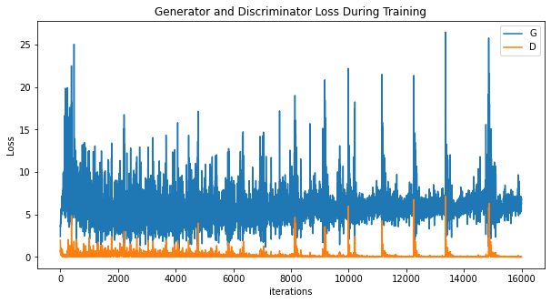 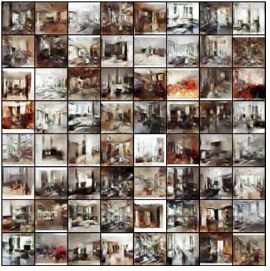

- batch_size=16, lr=0.0001, epoch=300

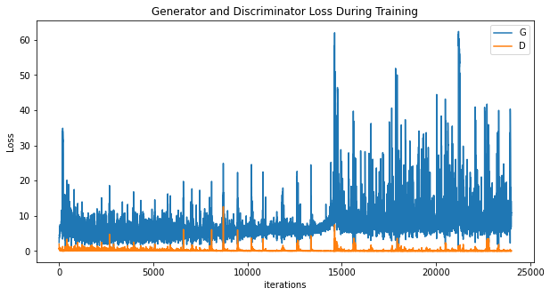 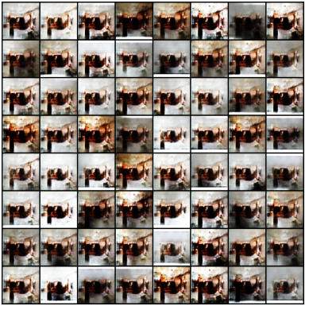

- batch_size=16, lr=0.0001, epoch=500

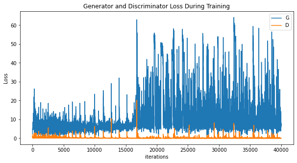 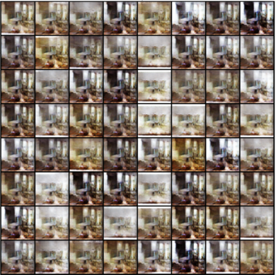

>[!NOTE] 
>故batch size隨著epoch增加訓練效果更好。


## 結果呈現

- **batch_size=64, lr=0.0001, epoch=800**

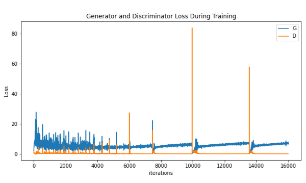 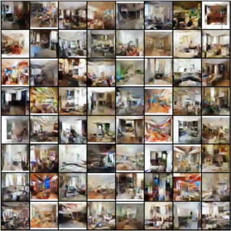

---

- **batch_size=64, lr=0.0001, epoch=1200**

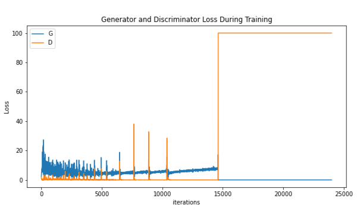 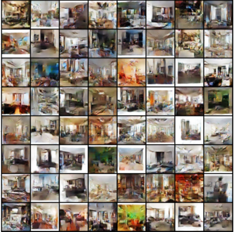

>[!NOTE] 
> 跑1200次最後幾回的損失值完全沒有震盪，後面跑的那幾次等於完全沒有意義，參數需要再修正。


---

- **batch_size=100, lr=0.0001, epoch=1500**


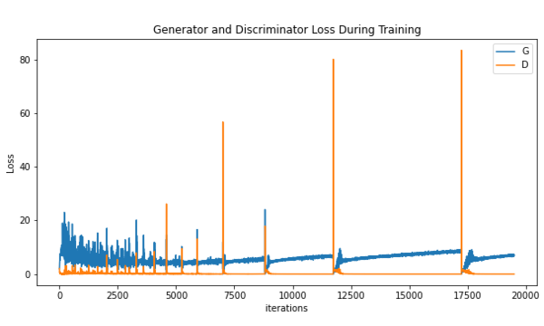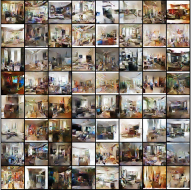


## 優化改進
- 資料庫圖片僅一千多張，訓練效果不佳，考慮加入StyleGAN2 with ADA演算法提升模型品質。
- 佈署。
